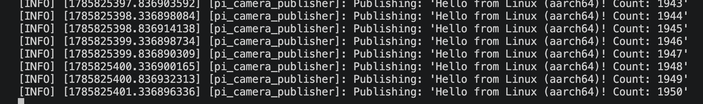
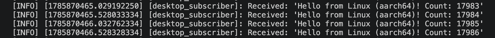

# camerobot ROS 2 Starter Guide

This README reflects the current working workflow for camera-frame transport as a serialized string.

It covers:
- Docker listener commands (Mac host running ROS in container)
- Raspberry Pi talker commands
- Full package sync from Docker workspace to Pi
- Clean rebuild and low-memory fallback on Pi

## Docker listener setup (Mac)

1. Install Docker Desktop for Mac.
2. Open Terminal.
3. Create the workspace:

```bash
mkdir -p ~/ros2_ws/src
cd ~/ros2_ws
```

4. Start the ROS 2 Jazzy container:

```bash
docker run -it --rm \
  --name ros2-jazzy-mac \
  -v ~/ros2_ws:/workspace \
  -w /workspace \
  osrf/ros:jazzy-desktop
```

The container opens in `/workspace`, so the commands below use that path directly.

5. Confirm the package is present:

```bash
ls src/camerobot
```

6. Build inside the container:

```bash
source /opt/ros/jazzy/setup.bash
rosdep update
rosdep install --from-paths src --ignore-src -r -y --rosdistro jazzy
colcon build --packages-select camerobot --symlink-install --cmake-args -DBUILD_TESTING=OFF
```

7. Run the listener with the current network env:

```bash
source /workspace/install/setup.bash
unset ROS_LOCALHOST_ONLY
unset FASTDDS_DEFAULT_PROFILES_FILE
export ROS_DOMAIN_ID=0
export RMW_IMPLEMENTATION=rmw_fastrtps_cpp
export ROS_AUTOMATIC_DISCOVERY_RANGE=SUBNET
ros2 run camerobot listener
```

## Raspberry Pi talker setup

1. Flash Ubuntu 24.04 aarch64 to the Raspberry Pi and boot it.
2. Connect to the Pi over SSH.
3. Install ROS 2 Jazzy and build tools:

```bash
sudo apt update
sudo apt install -y curl gnupg2 lsb-release ca-certificates
sudo mkdir -p /usr/share/keyrings
curl -sSL https://raw.githubusercontent.com/ros/rosdistro/master/ros.key \
  | sudo gpg --dearmour -o /usr/share/keyrings/ros-archive-keyring.gpg

echo "deb [arch=arm64 signed-by=/usr/share/keyrings/ros-archive-keyring.gpg] http://packages.ros.org/ros2/ubuntu noble main" \
  | sudo tee /etc/apt/sources.list.d/ros2.list

sudo apt update
sudo apt install -y ros-jazzy-desktop python3-rosdep python3-colcon-common-extensions build-essential cmake
```

4. Create the workspace on the Pi:

```bash
mkdir -p ~/ros2_ws/src
cd ~/ros2_ws/src
```

5. Copy the package from your Mac to the Pi:

```bash
scp -r ~/ros2_ws/src/camerobot <pi-user>@<pi-ip>:~/ros2_ws/src/
```

6. Build on the Pi:

```bash
source /opt/ros/jazzy/setup.bash
cd ~/ros2_ws
rosdep update
rosdep install --from-paths src --ignore-src -r -y --rosdistro jazzy
colcon build --packages-select camerobot --symlink-install --parallel-workers 1 --cmake-args -DBUILD_TESTING=OFF -DCMAKE_BUILD_PARALLEL_LEVEL=1
```

7. Run the talker:

```bash
source /opt/ros/jazzy/setup.bash
source /home/<pi-user>/ros2_ws/install/setup.bash
ros2 run camerobot talker
```

## Incremental update workflow

### Sync full package from Docker workspace to Pi

```bash
cd /workspace
scp -r /workspace/src/camerobot <pi-user>@<pi-ip>:/home/<pi-user>/ros2_ws/src/
```

### Clean rebuild on Pi after sync

```bash
cd /home/<pi-user>/ros2_ws
source /opt/ros/jazzy/setup.bash
rm -rf /home/<pi-user>/ros2_ws/build/camerobot /home/<pi-user>/ros2_ws/install/camerobot /home/<pi-user>/ros2_ws/log
colcon build --packages-select camerobot --symlink-install --parallel-workers 1 --cmake-args -DBUILD_TESTING=OFF -DCMAKE_BUILD_PARALLEL_LEVEL=1
source /home/<pi-user>/ros2_ws/install/setup.bash
```

### Low-memory fallback on Pi (OOM protection)

If the build is killed by OOM, use a temporary swapfile and sequential build:

```bash
sudo fallocate -l 2G /swapfile && sudo chmod 600 /swapfile && sudo mkswap /swapfile && sudo swapon /swapfile
free -h
rm -rf /home/<pi-user>/ros2_ws/build/camerobot /home/<pi-user>/ros2_ws/install/camerobot
cd /home/<pi-user>/ros2_ws
source /opt/ros/jazzy/setup.bash
MAKEFLAGS="-j1" colcon build --packages-select camerobot --executor sequential
```

After the build:

```bash
sudo swapoff /swapfile && sudo rm /swapfile
```

### Run order for verification

1. Start Pi talker.
2. Start Docker listener.
3. Confirm listener logs received frames.

## Current payload format

Talker publishes string payloads on `topic` in this format:

`v3|mono8|<width>|<height>|<base64>`

Listener is expected to receive the versioned format above.

## Screenshots

Current images are kept for reference.





TODO: recapture and replace both screenshots with current `v3` talker/listener logs after end-to-end verification.

## Notes

- Keep `ROS_DOMAIN_ID` the same on both machines.
- Always source `/opt/ros/jazzy/setup.bash` before building and running.
- Use `source install/setup.bash` after `colcon build`.
- Use `--parallel-workers 1 --cmake-args -DCMAKE_BUILD_PARALLEL_LEVEL=1` on the Pi for low-memory builds.

Camera notes (Pi ribbon camera)

- Ensure the camera is enabled and that the OS provides a V4L2 device (e.g. `/dev/video0`). On Ubuntu you may need to install and test `libcamera` (`libcamera-apps`) and `v4l-utils`.
- Install OpenCV and video utilities on the Pi before building:

```bash
sudo apt update
sudo apt install -y libopencv-dev v4l-utils
```

- Test the camera on the Pi before running the node:

```bash
# try libcamera preview (if available)
libcamera-hello -t 2000

# or list video devices
v4l2-ctl --list-devices
```

If your camera device appears as `/dev/video0`, `ros2 run camerobot talker` will capture and publish serialized frame strings on `topic`.

